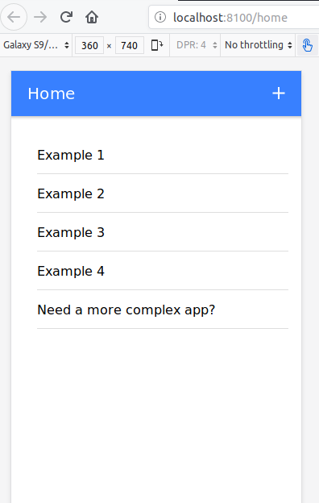

## Ionic 4 Starter App

### About this repo
This repo is the code of an Ionic 4 starter app that we created as part of a *Getting started with Ionic 4 tutorial*. In the following tutorial your will learn the differences between Ionic 3 and Ionic 4 and all the new concepts about Ionic 4:

- [Spanish tutorial](https://medium.com/learn-ionic-framework/ionic-4-vs-ionic-3-todo-lo-que-necesitas-saber-sobre-ionic-4-5235927c6dd9)

- [English tutorial](https://ionicthemes.com/tutorials/about/ionic-4-vs-ionic-3)

Find more Ionic 4 tutorials and starter apps in https://ionicthemes.com

### Install this Ionic 4 starter app
```
git clone https://github.com/hhzl/ionic4-starter-app.git
cd ionic4-starter-app/
npm install
```

### Browse Ionic 4 app
```
ionic serve
```



### Demo
https://www.youtube.com/watch?v=COTmXyXg5rU

### Environment check

Check environment and if necessary update

    ionic info

    Ionic CLI : 5.2.0

    Utility:

       cordova-res : not installed
       native-run  : 0.2.9 

    System:

       NodeJS : v10.17.0
       npm    : 6.11.3
       OS     : Linux 4.15


  ─────────────────────────────────────

     Update available: 5.2.0 → 5.4.9
      Run npm i -g ionic to update

  ─────────────────────────────────────
